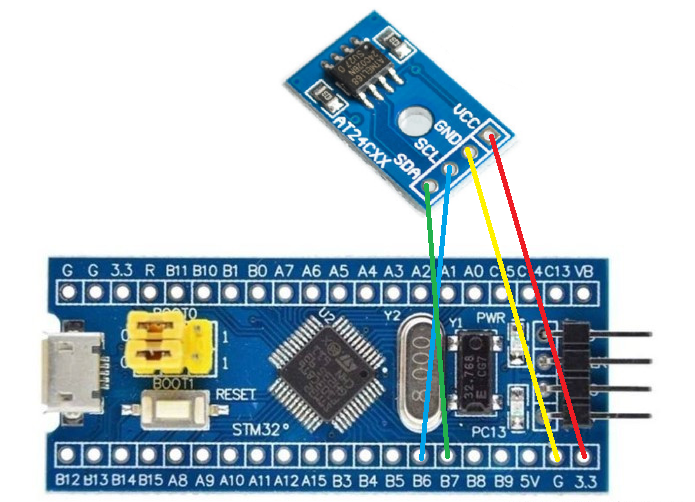
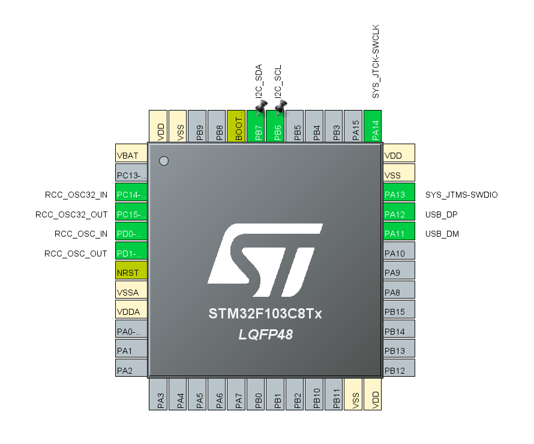

---

# 【神器发布】Nexus-Link V1.0：让 STM32 变身专业 I2C 协议分析仪，调试 EEPROM 竟如此简单！

在嵌入式开发的世界里，你是否曾为了读写一个 I2C 器件（如 EEPROM、传感器），不得不反复修改代码、编译、烧录、查看串口打印？这种“低效循环”往往浪费了大量开发时间。

今天，**Nexus-Link V1.0** 正式发布！它将你的 **STM32F103C8T6 (Blue Pill)** 瞬间转变为一台**串口 I2C 协议分析仪**。无需编写一行 C 代码，直接在串口助手中输入指令，即可像操作 Linux 命令行一样玩转 I2C 硬件。

---

### 🚀 核心卖点 (Key Features)

- **零代码调试**：支持通过串口发送 `[` (Start)、`]` (Stop)、`0xXX` (数据) 等逻辑指令，实时操控总线。
- **总线一键扫描**：输入 `s` 指令，全地址段扫描，让挂载的器件无所遁形。
- **硬件级性能**：基于 STM32 硬件 I2C 控制器设计，波形标准，远超模拟 IO 的稳定性。
- **极致便携**：只需一块几块钱的 Blue Pill 板子，即可替代部分昂贵的逻辑分析仪功能。

---

### 🛠️ 硬件连接指南 (Hardware Connection)

为了方便大家快速上手，我们提供了直观的接线图。请严格按照以下引脚定义进行连接：

#### 1. 实物接线参考

如图所示，将 STM32 与 AT24C64 (EEPROM) 模块连接。注意：**VCC 请务必接 3.3V**，并确保 SDA/SCL 已接入上拉电阻。

_(注：请在保存时将此链接替换为你 GitHub 仓库中的图片路径)_

#### 2. 引脚定义图 (STM32CubeMX)

本固件深度优化了 STM32F103C8T6 的硬件 I2C1 接口（PB6/PB7）：

_(注：请在保存时将此链接替换为你 GitHub 仓库中的图片路径)_

| I2C 信号 | STM32 引脚 | 备注                         |
| :------- | :--------- | :--------------------------- |
| **SCL**  | **PB6**    | 需外接 4.7kΩ 上拉电阻至 3.3V |
| **SDA**  | **PB7**    | 需外接 4.7kΩ 上拉电阻至 3.3V |
| **VCC**  | 3.3V       | 严禁接 5V                    |
| **GND**  | GND        | 必须与目标板共地             |

---

### 💻 它是如何工作的？

只需将 Nexus-Link 固件烧录进你的 STM32，打开电脑串口助手（如 Mobaxterm、SSCOM）：

- **想写入数据？** 输入：`[0xA00x000x010xAB]`
- **想读取数据？** 输入：`[0xA00x000x01[0xA1n]`

这种**所见即所得**的交互方式，是学习 I2C 协议底层逻辑的最佳实践工具。

---

### 📦 立即获取

**固件购买：**
👉 [GitHub 仓库 - Nexus-Link V1.0](https://m.tb.cn/h.8ZQmQeR?tk=9YGfgKsLALx)

---

### 🤝 加入我们的 Maker 计划 (Open for Collaboration)

我们深知，一个工具的力量源于社区的共同浇灌。**Nexus-Link 不仅仅是一个固件，它更是 Maker 精神的载体。**

我们热烈欢迎全球的开发者、极客参与到 `Workbench` 项目中来：

1.  **欢迎 Fork**：访问我们的 GitHub 分支 [maker-eric/workbench (posts branch)](https://github.com/maker-eric/workbench/tree/posts)。
2.  **提交 Pull Request**：如果你基于此开发了新的功能（如 SPI/CAN 支持），欢迎发起 PR！
3.  **合并作品**：优质的作品/文章将被合并到本站点的官方文档库中，获得全平台的曝光。

让我们一起，为 Maker 们打造更趁手的“兵器”！

---

### 📈 SEO 标签

Keywords: STM32, I2C Debugger, AT24C64, EEPROM, BluePill, Maker Tools.

---
