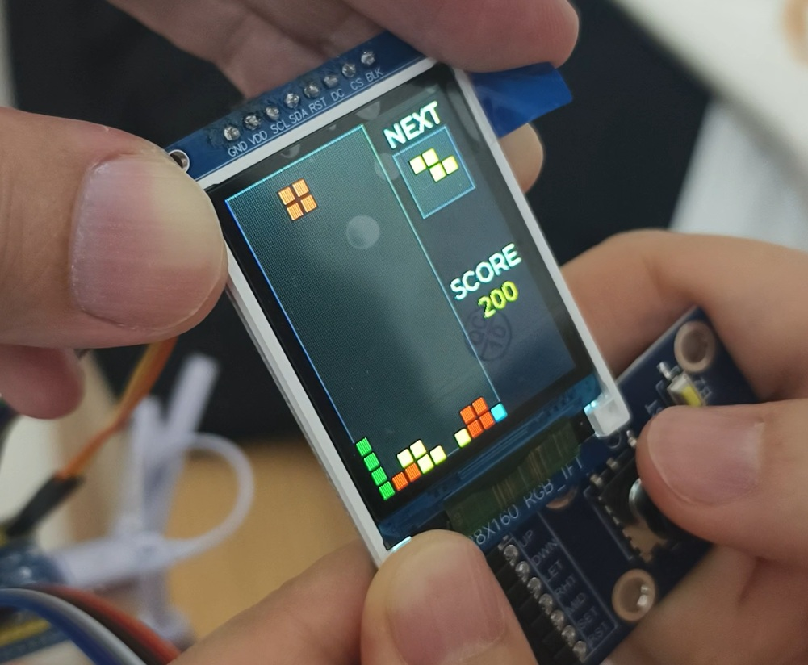
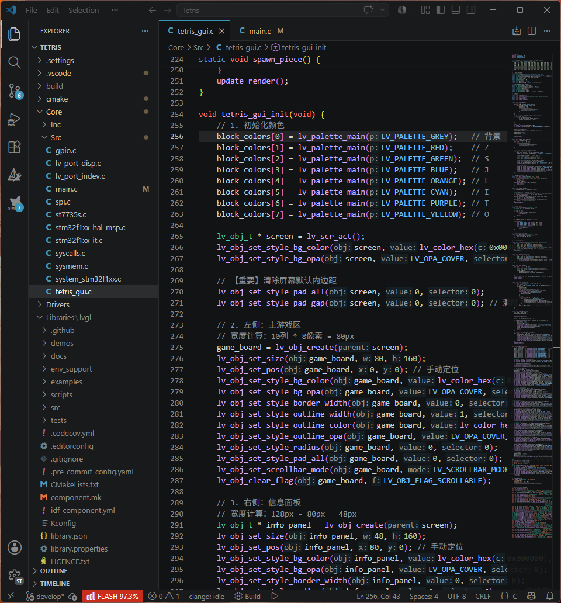
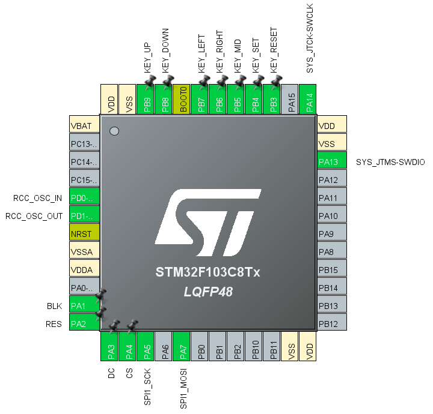

# 【开箱即用】STM32 + LVGL + VS Code 开发全家桶：从俄罗斯方块开始，开启你的 GUI 创作之路！

在 STM32 上跑 LVGL（轻量级图形库）最痛苦的是什么？
不是写 UI，而是**搭建环境**：配置编译器、移植屏幕驱动、处理文件包含、适配输入设备…… 往往环境还没配好，灵感就消失了。

今天，我们为你带来 **LVGL-STM32-Scaffold V1.0**。这不仅是一个“俄罗斯方块”游戏，更是一套**为你准备好的、工程级的开发脚手架**！

---

### 📺 演示视频 (Demo Video)

> _上图展示了：基于 LVGL 框架实现的经典俄罗斯方块。在 1.8 寸 TFT 屏上，通过 5 向机械按键实现流畅旋转、移动与消行。_

---

### 🚀 核心卖点 (Why This Scaffold?)

1.  **现代化开发流**：彻底告别收费且缓慢的 Keil。基于 **VS Code + GCC + Makefile (或 CMake)**，代码补全极快，支持 Git 版本管理。
2.  **深度适配硬件**：
    - **核心板**：STM32F103C8T6（Blue Pill）。
    - **屏幕驱动**：已完美移植 **ST7735S (1.8寸 TFT)**，支持 DMA 加速，画面丝滑。
    - **输入抽象**：已封装 **5 向机械按键**（上下左右+中间确认）作为 LVGL 的 `indev` 输入设备。
3.  **零门槛上手**：拉取仓库，一键编译。环境已配置好路径映射，你只需要专注于业务代码。
4.  **实战级案例**：内置的俄罗斯方块代码，展示了如何用 LVGL 实现复杂的逻辑交互，是学习 GUI 架构的最佳样板。

#### 💻 专业的代码开发体验

_清晰的工程目录，完美的语法高亮，让嵌入式开发像前端一样优雅。_

---

### 🛠️ 硬件配置 (Hardware Setup)

为了获得与演示视频一致的效果，建议连接：

| 模块         | 型号/参数          | 备注                           |
| :----------- | :----------------- | :----------------------------- |
| **主控**     | STM32F103C8T6      | 经典的“蓝棒”                   |
| **显示屏**   | 1.8" TFT (ST7735S) | 128x160 分辨率                 |
| **输入**     | 5 向机械按键       | 用于操控方块移动与旋转         |
| **开发环境** | VS Code            | 需安装 C/C++ 插件与 ARM 工具链 |

#### 📍 芯片引脚定义 (Pinout)

我们为你规划好了最合理的 IO 分配，包括 SPI 显示接口和按键输入：

| 功能模块              | 引脚分配                                                  | 备注               |
| :-------------------- | :-------------------------------------------------------- | :----------------- |
| **TFT 显示屏 (SPI1)** | PA1(BLK), PA2(RES), PA3(DC), PA4(CS), PA5(SCK), PA7(MOSI) | 高速 DMA 驱动      |
| **5 向机械按键**      | PB9(UP), PB8(DOWN), PB7(LEFT), PB6(RIGHT), PB5(MID)       | 适配 LVGL 组管理   |
| **系统功能**          | PB4(SET), PB3(RESET)                                      | 用于设置与重置游戏 |

---

### 📦 立即获取

我们提供两部分内容，满足不同层次的需求：

#### 1. 完整开发脚手架 (Scaffold)

**售价：[30]**
包含：VS Code 工程配置文件、移植好的 LVGL 库、ST7735 驱动源码、按键输入驱动。
👉 [GitHub 仓库/下载地址](https://m.tb.cn/h.8ZLKWF4?tk=SnAlgKybfft)

#### 2. 俄罗斯方块固件 (Firmware)

**售价：0.1 元 (象征性支持)**
如果你只想看效果，可以直接烧录这个编译好的二进制文件。
👉 [点击此处获取固件](https://m.tb.cn/h.8aMrFi3?tk=22UDgKCzmW6)

---

### 🤝 加入我们的 Maker 计划 (Open for Collaboration)

我们希望构建一个“开箱即用”的嵌入式工具集。如果你也热爱 Maker 文化：

- **欢迎 Fork**：访问我们的 GitHub 分支 [maker-eric/workbench (posts branch)](https://github.com/maker-eric/workbench/tree/posts)。
- **提交 Pull Request**：如果你适配了更多的屏幕（如 ILI9341）或更多的游戏（如贪吃蛇），欢迎提交 PR！
- **共建站点**：优质的 LVGL 插件和脚手架将被合并到官方文档，共享流量与致谢。

---

### 📈 SEO 标签

Keywords: STM32, LVGL, VSCode, 俄罗斯方块, ST7735, 嵌入式GUI, 开源硬件, Maker, 单片机开发,STM32F103C8T6, GUI脚手架

---
